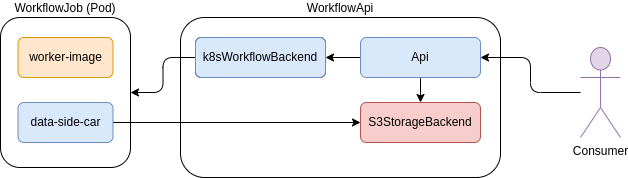
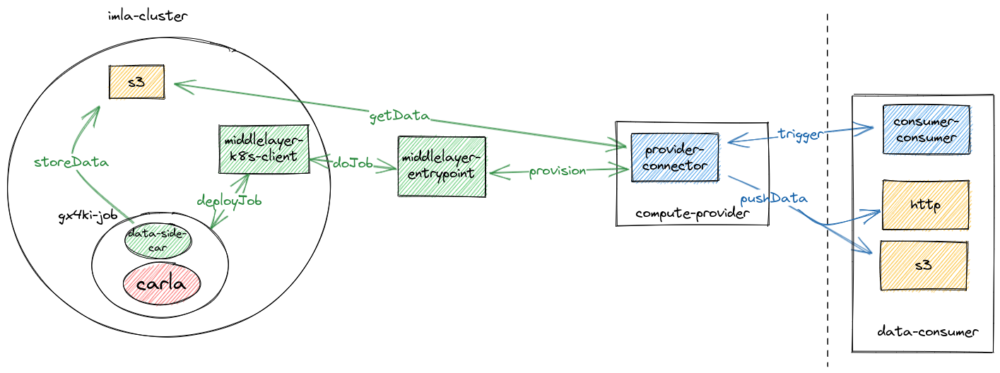

# Workflow API

This is the repository for the workflow-api project.
It provides a simple single user interface to manage compute jobs and related data in a specified workflow backend.

At the moment a very simple workflow backend is implemented to manage compute jobs in K8s.
To manage the user data the workflow api relies on a [Minio storage backend][1], which needs to be deployed separately.

## Compute Assets

The structure of the API focusing on so called compute assets which the user can manage.
In the simplest form the compute asset consists of a app, wich is the container to run, the hardware requirements (at the moment just GPU (YES/NO)) and the in- and output resources.

> **_Note:_** Compute asses currently called `services` in the api

The compute assets are resources predefined by the workflow administrator that are made available to consumers.
First, the compute asset must be defined, i.e. it is first determined which container is executed with which resources.
In addition, input resources such as source files or environments are defined, with which the execution is adapted to a certain degree to the requirements of the consumer.
Finally, the compute asset must be assigned an asset ID with which it is registered in the EDC Connector.

> **_Note:_** (Feature -- NOT Implemented) Extended Compute Assets are a special kind in which it is allowed to upload and specify the own App/Container


## API

The following image shows the modules and components which are involved in the workflow-api.


The Workflow API itself consists of an API which is the interface for the user interaction. An external S3StorageBackend Component, which is covered by a Minio deployment and stores the input and output data for an worker image. The third module is the K8sWorkflowBackend, which does the communication with the backend K8s cluster, to deployment, monitoring and cleanup of WorkflowJobs

The WorkflowJob is a running Pod inside the Cluster, which is processing a long running task or some interactive job.
The main part of such a job is a worker-image, which is a container image with a predefined application and provides maybe some configuration options to change the behavior of the application.
E.g. in case of a Pytorch trainings pipeline, environment variables or source scripts to change the training for the need of the consumer.
The `data-side-car` module is also a container image, which responsible to store the result data back to to consumers persistent storage, after the worker-image has finished.

> **_Note:_** interactive jobs currently not implemented.

---

## Demo Deployment

At the moment the deployment of the workflow-api is a little complex because of the components which relies on, as described above.
To make it a little easy there is a docker-compose script to run the WorkflowApi and a Minio Storage locally besides local minikube cluster.


### Prerequisite

- k8s-cluster (minkube tested in local environment)
  - check your minikube ip `minikube ip` adapt the ip config in [docker-compose](./docker-compose.yaml) file.
- docker
- docker-compose


### Deployment


**Deploy k8s_client**

To run the the k8s_client in the Kubernetes some preconditions are required.
1. Apply the service Account: `kubectl apply -f k8s/gx4ki-sa-auth.yaml`
2. Create a middleware config `cp config/middlelayer.conf.tmpl config/middlelayer.conf`
   - provide the required configurations options
   - and apply the secret
3. if necessary create and apply an registry-secret
4. deploy the k8s client into the cluster or run it as a standalone container (requries a kubeconfig file)


```shell
docker run -it --rm --name k8s-client \
-v $(pwd)/config/minikube.kubeconfig:/opt/k8s-api/config/kubeconfig \
-v $(pwd)/config/middlelayer.conf:/opt/k8s-api/config/middlelayer.conf \
--network minikube \
--ip 192.168.49.5 \
gx4ki/imla-k8s-api
```

**Deploy Middleware Entrypoint**

Deploy a standalone mw_entrypoint with the provided docker-compose file.

```shell
docker-compose -f docker-compose.entrypoint.yaml up
```

### Work Items

- **DONE** create ServiceAccount which deploys jobs into a specifc namespace
- **DONE** create ConfigMaps from env-file and use it in jobs
- **POSTPONED**how to get dotenv-file from outside to imla-api? [comunication-overview](./docs/edc-dotenv-transfer.excalidraw)
  - dotenv-file and job-config files read from local directory
- **DONE** adapt job to carla
- **FAIL** download result files directly to imla-k8s-client -- rosbag file changed during transfer()
- **DONE** upload result files to minio
  - **DONE** get resultfile from minio and send it as response
- **DONE** deploy k8s-api in gx4ki-cluster
- test with connector
  - **FAIL** timeout problems after trigger carle and wait for result.
    - there is a provider provision tate in the in the workflow of the transfer.
      This state works with webhooks and callbacks which enables to process a long running job, bevor the data is ready.
      This functionality facilitates the gx4ki-middlelayer to deploy a long running job into.
      After the job finishes the callback communicates to the connector where the result data can be fetched.
  - **DONE** Implement provision handler in entrypoint


### Demo Use-Case

Carla-Demo V0.1

Run all in once:
1. trigger job in provison phase of connector

2. trigger job execution with job-config and dotenv-file
    - create configmap from dotenv-file
    - deploy job in cluster
    - wait for finish
    - store rosbag result

3. post callback to connector with storage information
4. data transfer from minio over connector to datasink




### Discussion

**Compute-/Service-Provider**

I started a [Discussion#2405](https://github.com/eclipse-edc/Connector/discussions/2405) in EDC-Connector Repo, how we can address the feature of compute-/ service-offering in a data space.
As far as I understand the answer, which I got so far. The connector is just used to provision a backend data-plane and some secrets to access it.
The following picture shows that concept.


1. request asset
2. trigger provision
  1.  provision of storage
  2. share credentials
3. http-backend gets information and triggers file transfers from data-providers or uploads files from own storage
4. Negotiation of asset from third party/dataspace participant
   1. transfer file
5. Trigger to start processing
6. execute and observe service/job
  - state of executions (callback or polled by data-consumer)


---

## Developer Topics

Some useful information during development.

### Create ServiceAccount

To be authorized against the control plane of the k8s api a serviceaccount is created and used.
This serviceaccount is bound to its `clusterrolebindung` to a `clusterrole` with the allowed rules/permissions.

- a `serviceAccount` is only from within the cluster usable.
- a cluster wide RBAC is used becaus at api start the `/healthz` of k8s is requested
  - this should be replaced

https://kubernetes.io/docs/reference/access-authn-authz/rbac/
https://kubernetes.io/docs/tasks/configure-pod-container/configure-service-account/
https://betterprogramming.pub/k8s-tips-using-a-serviceaccount-801c433d0023
https://stackoverflow.com/questions/71265398/kuberentes-rbac-rule-to-allow-creating-jobs-only-from-a-cronjob

### Create ConfigMaps in K8s

Applications in Pods are requred to be configurable by environment variables.
Environment and other configuraion files can be stored in k8s by ConfigMaps and/or Secrets.

### Read Result Data from Pods

Read/Load Files from a Container is very complicated to achieve.

what have I tried so far:
- use kubernetes-python client and stream the data via stdout out of the container by executing `cat resultfile`
  - rosbag file (binary file) is somehow changed by transfer
- create kubernetes-python client equivalent to `kubectl cp` (-> internally it's a kube exec with tar cf | tar xf )

## Reference

[1]: https://min.io/
