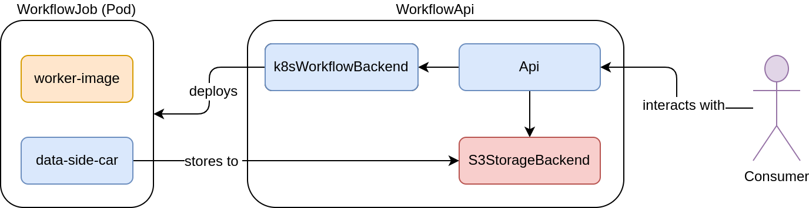
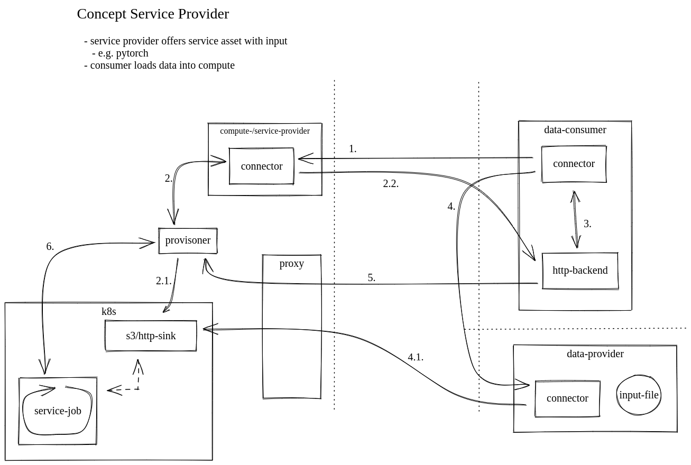

# Workflow API

This is the repository for the workflow-api project.
It provides a simple single user interface to manage compute jobs and related data in a specified workflow backend.

At the moment a very simple workflow backend to a Kubernetes Cluster is implemented.
To manage the user data the workflow api relies on a [Minio storage backend][1], which needs to be deployed separately.

## Workflow Assets

The API is focusing on so called workflow assets, which the user can manage.
In the simplest form the workflow asset consists of a app, wich is the container to run, the hardware requirements (at the moment just GPU (YES/NO)), a directory inside of the container, in which the result of the app will be persisted and the in- and output resources.

> **_Note:_** workflow asses currently called `services` in the api

> **_Note:_** the WorkflowApi is currently only able to load static and predefined assets, later they will/should be loaded from a database.

For development and testing purpose static created assets can be defined and later loaded into the workflowApi.
A predefined [dummy asset](config/assets/dummy.json) exists demonstrate the functionality.
This can be used and adapted for own tests with other worker-images.


## API

The following image shows the modules and components which are involved in the workflow-api.


The Workflow API itself consists of an API which is the interface for the user interaction.
An external S3StorageBackend Component, which is covered by a Minio deployment and stores the input and output data for an worker image.
The third module is the K8sWorkflowBackend, this is responsible for the communication with the backend K8s cluster, to deployment, monitoring and cleanup of WorkflowJobs

The WorkflowJob is a running Pod inside the Cluster, which is processing a long running task or some interactive job.
The main part of such a job is a worker-image, which is a container image with a predefined application and provides maybe some configuration options to change the behavior of the application.
E.g. in case of a Pytorch trainings pipeline, environment variables or source scripts to change the training for the need of the consumer.
The `data-side-car` module is also a container image, which responsible to store the result data back to to consumers persistent storage, after the worker-image has finished.

> **_Note:_** interactive jobs currently not implemented.

---

## Demo Deployment

At the moment the deployment of the workflow-api is a little complex because of the components which relies on, as described above.
To make it a little easy there is a docker-compose script to run the WorkflowApi and a Minio Storage locally besides a local minikube cluster.
But there are some prerequisites which needs to be addressed bevor we can deploy and run the workflow-api.

### Prerequisite

- k8s-cluster (minkube tested in local environment)
  - check your minikubes cluster ip with `minikube ip` adapt the ip config in [docker-compose](./docker-compose.yaml) file.
- docker
- docker-compose
- the data-side-car container needs be ready, public version `imlahos/data-side-car`
- a workflow-job
  - [dummy-job](https://github.com/reisman234/dummy-job) for testing purpose, public available `imlahso/dummy-job`

### Configuration

1. Create `workflow-api.cfg`, by copying the prepared local config file `cp ./config/workflow-api.demo.cfg ./config/workflow-api.cfg`
2. Use the `make demo-config`  target from the [makefile](./makefile) to prepare the k8s-cluster and the kubeconfig file.
   - test the created kubeconfig file by running and deleting a pod:
      - start pod:
        ```bash
          kubectl --kubeconfig config/kube/config -n gx4ki-demo run test --image=alpine -- sh
        ```
      - remove pod:
        ```bash
         kubectl --kubeconfig config/kube/config -n gx4ki-demo delete pod test
        ```
### Build and Deploy the Workflow-API

- Build and run the workflow-api via `docker-compose`: <br>
  `docker-compose up --build`

The workflow-api and the storage backend should now be build and starting.
The api itself should print the fooling lines:

```sh
workflow-api        | 2023-06-09 09:06:59,235 - workflow_api - DEBUG - load config file {'./config/workflow-api.cfg'}
workflow-api        | 2023-06-09 09:06:59,236 - workflow_api - DEBUG - set root_path=/
workflow-api        | INFO:     Started server process [1]
workflow-api        | INFO:     Waiting for application startup.
workflow-api        | INFO:     Application startup complete.
workflow-api        | INFO:     Uvicorn running on http://0.0.0.0:8080 (Press CTRL+C to quit)
```

The API should now be available unter the configured `WORKFLOW_API_IP`, e.g. `http://192.168.49.5:8080`, if the minikube network has not changed.
To test request against the api go to the `/docs` subpath and use the openapi ui.
Analog to that the web ui for the minio should be available at `http://192.168.49.6:9090`.


### Discussion

**Compute-/Service-Provider**

I started a [Discussion#2405](https://github.com/eclipse-edc/Connector/discussions/2405) in EDC-Connector Repo, how we can address the feature of compute-/ service-offering in a data space.
As far as I understand the answer, which I got so far. The connector is just used to provision a backend data-plane and some secrets to access it.
The following picture shows that concept.


1. request asset
2. trigger provision
  1.  provision of storage
  2. share credentials
3. http-backend gets information and triggers file transfers from data-providers or uploads files from own storage
4. Negotiation of asset from third party/dataspace participant
   1. transfer file
5. Trigger to start processing
6. execute and observe service/job
  - state of executions (callback or polled by data-consumer)




## Reference

[1]: https://min.io/

---


## Developer Topics

Some useful information during development.

### Create ServiceAccount

To be authorized against the control plane of the k8s api a serviceaccount is created and used.
This serviceaccount is bound to its `clusterrolebindung` to a `clusterrole` with the allowed rules/permissions.

- a `serviceAccount` is only from within the cluster usable.
- a cluster wide RBAC is used becaus at api start the `/healthz` of k8s is requested
  - this should be replaced

https://kubernetes.io/docs/reference/access-authn-authz/rbac/
https://kubernetes.io/docs/tasks/configure-pod-container/configure-service-account/
https://betterprogramming.pub/k8s-tips-using-a-serviceaccount-801c433d0023
https://stackoverflow.com/questions/71265398/kuberentes-rbac-rule-to-allow-creating-jobs-only-from-a-cronjob

### Create ConfigMaps in K8s

Applications in Pods are requred to be configurable by environment variables.
Environment and other configuraion files can be stored in k8s by ConfigMaps and/or Secrets.

### Read Result Data from Pods

Read/Load Files from a Container is very complicated to achieve.

what have I tried so far:
- use kubernetes-python client and stream the data via stdout out of the container by executing `cat resultfile`
  - rosbag file (binary file) is somehow changed by transfer
- create kubernetes-python client equivalent to `kubectl cp` (-> internally it's a kube exec with tar cf | tar xf )

